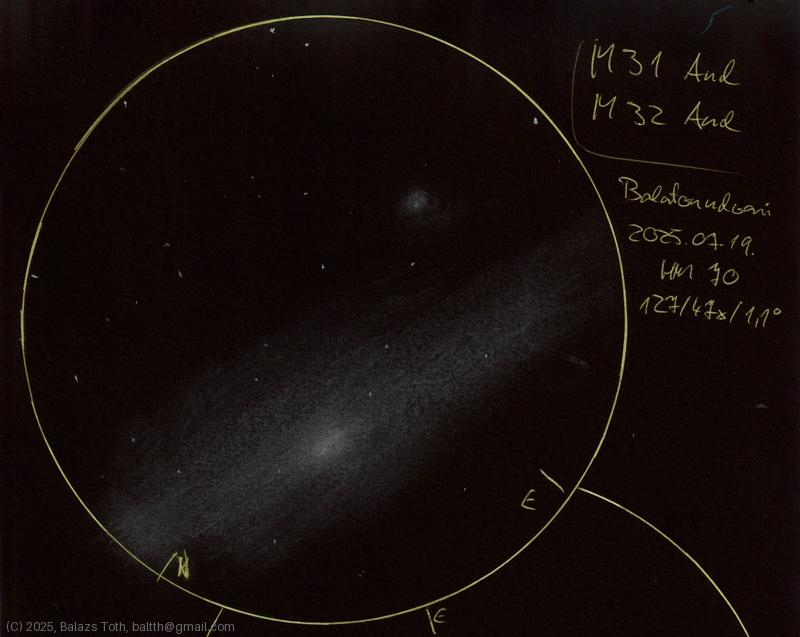

> This site contains some astronomy sketches, created just for fun.
> More info coming soon.
> 
> Balazs Toth
> baltth@gmail.com

---

## Latest

- 2025-08-06: [Saturn](obs/saturn-2025-08-06.md)
- 2025-08-06: [Theta Serpentis](obs/theta-ser-2025-08-06.md)
- 2025-08-04: [Eta Cassiopeiae](obs/eta-cas-2025-08-04.md)
- 2025-08-04: [70 Ophiuchi](obs/70-oph-2025-08-04.md)
- 2025-08-02: [1 Pegasi](obs/1-peg-2025-08-02.md)
- 2025-08-02: [STF 2841](obs/stf-2841-2025-08-02.md)
- 2025-07-30: [Messier 39](obs/m39-2025-07-30.md)
- 2025-07-30: [Messier 29](obs/m29-2025-07-30.md)
- 2025-07-28: [Messier 2](obs/m2-2025-07-28.md)
- 2025-07-28: [Epsilon Equulei](obs/epsilon-equ-2025-07-28.md)

---

### [All observations](pages/log.md)

### [Index](pages/obj_index.md)

---

...

