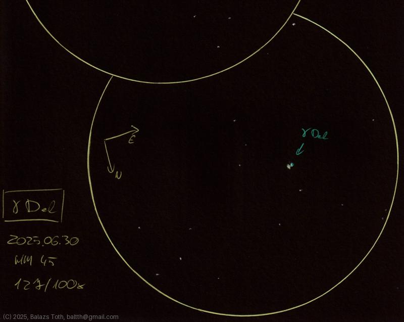

# Gamma Del

[Main page](../index.md) - [Index](../pages/obj_index.md)

_γ Del_ - _Gamma Delphini_ - _Double star in Delphinus_  

Object | Gamma Delphini
-|-
Observed at | Dunaharaszti, HU, 2025-06-30
NELM | ~ 4.5
Aperture | 127 mm
Magnification | 100x
FOV | 0.68 °

## Links

- [Full sketch](../img/m15-gamma-del-20250701.jpg)
- [Original sketch](../scan/20250701_2.jpg)
