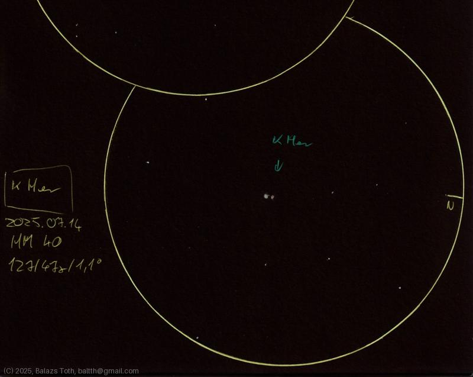

# Kappa Herculis

[Main page](../index.md) - [Index](../pages/obj_index.md)

_Kappa Her_ - _κ Her_ - _Double star in Hercules_  

Object | Kappa Herculis
-|-
Observed at | Dunaharaszti, HU, 2025-07-14
NELM | ~ 4.0
Aperture | 127 mm
Magnification | 47x
FOV | 1.1 °

## Links

- [Full sketch](../img/zeta-uma-80-uma-kappa-her-20250715.jpg)
- [Original sketch](../scan/20250715_1.jpg)
