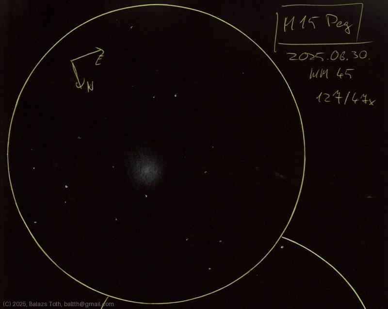

# M15

[Main page](../index.md) - [Index](../pages/obj_index.md)

_M15_ - _Globular cluster in Pegasus_  

Object | M15
-|-
Observed at | Dunaharaszti, HU, 2025-06-30
NELM | ~ 4.5
Aperture | 127 mm
Magnification | 47x
FOV | 1.1 °

## Links

- [Full sketch](../img/m15-gamma-del-20250701.jpg)
- [Original sketch](../scan/20250701_2.jpg)
