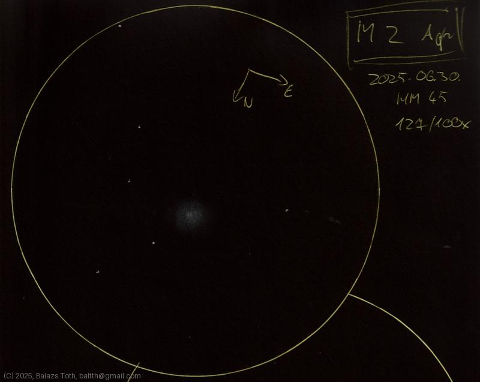

# M2

[Main page](../index.md) - [Index](../pages/obj_index.md)

_M2_ - _Globular cluster in Aquarius_  

Object | M2
-|-
Observed at | Dunaharaszti, HU, 2025-06-30
NELM | ~ 4.5
Aperture | 127 mm
Magnification | 100x
FOV | 0.68 °

## Links

- [Full sketch](../img/m2-ngc7009-20250701.jpg)
- [Original sketch](../scan/20250701_1.jpg)
