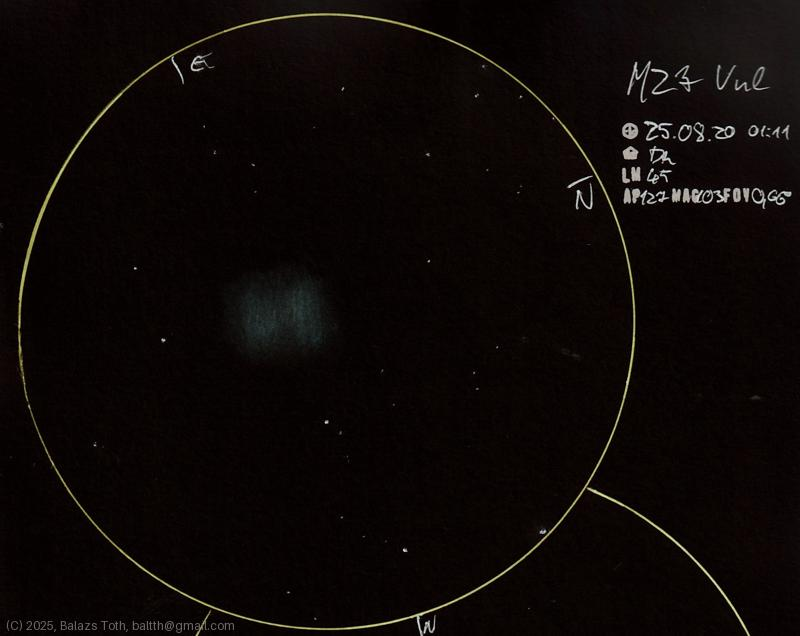

# Messier 27

[Main page](../index.md) - [Index](../pages/obj_index.md)

_M27_ - _NGC 6853_ - _Dumbbell Nebula_ - _Planetary nebula in Vulpecula_  

Object | Messier 27
-|-
Observed at | Dunaharaszti, HU, 2025-08-20
NELM | ~ 4.5
Aperture | 127 mm
Magnification | 103x
FOV | 0.66 °

## Links

- [Full sketch](../img/m27-61-cyg-20250820.jpg)
- [Original sketch](../scan/20250820_2.jpg)
