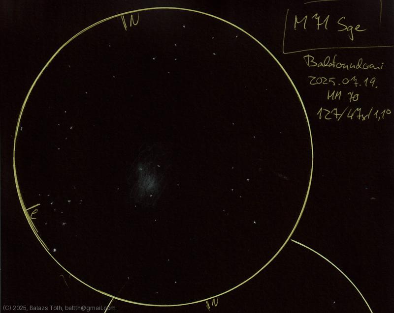

# Messier 71

[Main page](../index.md) - [Index](../pages/obj_index.md)

_M71_ - _NGC 6838_ - _Angelfish Cluster_ - _Globular cluster in Sagitta_  

Object | Messier 71
-|-
Observed at | Balatonudvari, HU, 2025-07-19
NELM | ~ 7.0
Aperture | 127 mm
Magnification | 47x
FOV | 1.1 °

> While the location has nice Bortle 4.5 sky, I've created
> this sketch surrounded by street lights. These lights made
> dark adaptation extremely difficult.

## Links

- [Full sketch](../img/m71-beta-cyg-20250722.jpg)
- [Original sketch](../scan/20250722_1.jpg)
