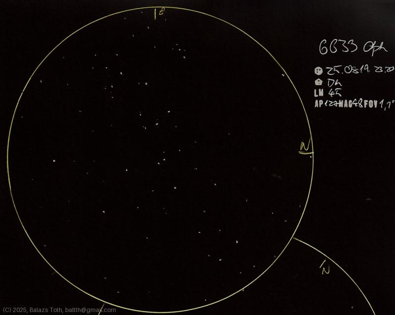

# NGC 6633

[Main page](../index.md) - [Index](../pages/obj_index.md)

_NGC 6633_ - _Open cluster in Ophiuchus_  

Object | NGC 6633
-|-
Observed at | Dunaharaszti, HU, 2025-08-19 23:20
NELM | ~ 4.5
Aperture | 127 mm
Magnification | 48x
FOV | 1.1 °

## Links

- [Full sketch](../img/ngc-6633-m57-20250820.jpg)
- [Original sketch](../scan/20250820_1.jpg)
