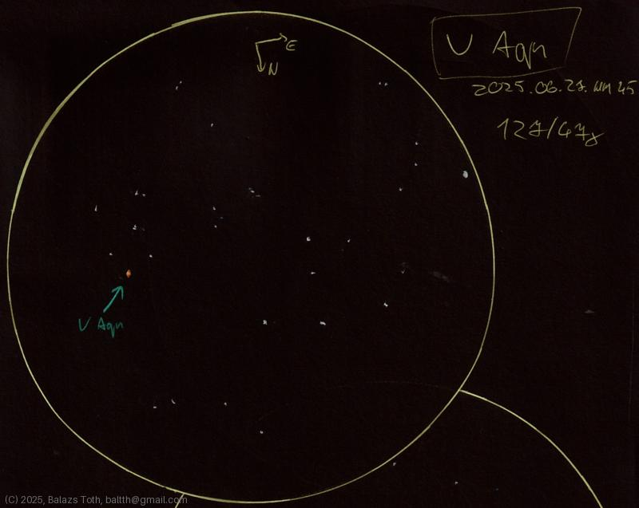

# V Aql

[Main page](../pages/index.md) | [Index](../pages/obj_index.md)

_V Aquilae_ | _Carbon star in Aquila_  

Object | V Aquilae
-|-
Observed at | Dunaharaszti, HU, 2025-06-27
NELM | ~ 4.5
Aperture | 127 mm
Magnification | 47x
FOV | 1.1 °

## Links

- [Full sketch](../img/v-aql-wz-cas-20250628.jpg)
- [Original sketch](../scan/20250628_2.jpg)
