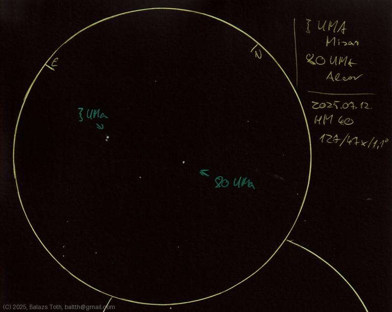

# Zeta UMa, 80 UMa

[Back to index](../main.md)

_ζ UMa_ | _Zeta Ursae Majoris_ | _Mizar_ | _Double star in Ursa Major_  
_80 Ursae Majoris_ | _Alcor_ | _Star in Ursa Major_  

Objects | Zeta Ursae Majoris, 80 Ursae Majoris
-|-
Observed at | Dunaharaszti, HU, 2025-07-12
NELM | ~ 4.0
Aperture | 127 mm
Magnification | 47x
FOV | 1.1 °

## Links

- [Full sketch](../img/zeta-uma-80-uma-kappa-her-20250715.jpg)
- [Original sketch](../scan/20250715_1.jpg)
